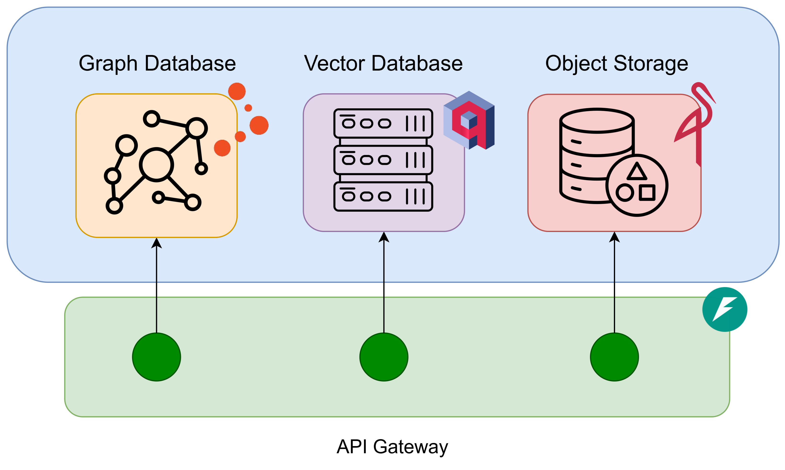

# ArtKb — Multimodal Knowledge Base for Art

<div align="center">
  <h3>ArtKb — Multimodal Knowledge Base for Art</h3>

  [Giacomo Blanco](mailto:giacomo.blanco@linksfoundation.com)<sup>1</sup>, [Tommaso Monopoli](mailto:tommaso.monopoli@linksfoundation.com)<sup>1</sup>, [Federico D'Asaro](mailto:federico.dasaro@polito.it)<sup>3,1</sup>, [Anastasia Dimou](mailto:anastasia.dimou@kuleuven.be)<sup>2</sup>, [Ruben Peeters](mailto:ruben.peeters@kuleuven.be)<sup>2</sup>, [Xuemin Duan](mailto:xuemin.duan@kuleuven.be)<sup>2</sup>, [Giuseppe Rizzo](mailto:giuseppe.rizzo@linksfoundation.com)<sup>1</sup>
  <br>
  <sup>1</sup> LINKS Foundation, Turin, Italy <br>
  <sup>2</sup> Department of Computer Science, Flanders Make, Leuven.AI, KU Leuven,
Sint-Katelijne Waver, Belgium <br>
  <sup>3</sup> Dipartimento di Automatica e Informatica (DAUIN), Politecnico di Torino, Turin,
Italy
  <br>

   [](https://opensource.org/licenses/MIT)

---

**Overview** | **Installation** | **API Usage** | **Web UI** | **Citation**
:---: | :---: | :---: | :---: | :---:
[Jump](#overview) | [Jump](#installation) | [Jump](#api_usage) | [Jump](#web_ui) | [Jump](#citation)

</div>


ArtKb is a multimodal knowledge base (KB) for artworks that combines image embeddings, file/object storage, and a GraphDB-backed RDF knowledge graph. The project provides a Docker-based deployment, services configuration helpers, and a FastAPI backend exposing endpoints for uploading images/files, running similarity searches, suggesting/inferencing metadata, SPARQL queries and composed image retrieval.

---

## <a id="overview"></a> 🔭 Overview
The KB is composed of the following services:
- Object Storage: MinIO for storing digital representation of artefacts
- Vector DB: Qdrant for image embeddings & similarity search 
- Knowledge Graph: GraphDB repository for semantic representation and querying
- API backend: FastAPI app for interacting with the KB



---

## <a id="installation"></a> ⚙️ Installation
1. Checkout to main branch and pull
    ```bash
     source manage.sh init
    ```

2. Copy and edit environment template
   - Copy [envs/env.template](envs/env.template) to `envs/dev.env` (or `envs/prod.env`) and fill all variables (GraphDB, MinIO, Qdrant, Triton, API settings).
   - Important: ensure `triton_config_path` points to a Triton config YAML available to the backend container.

3. Start services (build + run)
   - Build and run services (example for dev):
     ```bash
     source manage.sh run dev --build -d
     ```
     See [manage.sh](manage.sh) for available commands and behavior.

3. Initialize services (create buckets, collections, GraphDB repo, users)
   - Run the boot profile to configure services:
     ```bash
     source manage.sh boot dev
     ```
   - The boot container uses [containers/boot/Dockerfile](containers/boot/Dockerfile) and the script [containers/boot/configure.py](containers/boot/configure.py) which:
     - Creates MinIO buckets (configured via `MINIO_IMAGE_BUCKET_NAME`, `MINIO_FILE_BUCKET_NAME`)
     - Creates a Qdrant collection (`QDRANT_COLLECTION_NAME`) using qdrant-client of a specified size (`QDRANT_COLLECTION_SIZE`)
     - Enables security on GraphDB and creates a repository from [containers/boot/repo-config.ttl](containers/boot/repo-config.ttl)
     - Creates a GraphDB user with repository permissions
---

## <a id="api_usage"></a> 🖥 API Usage

All endpoints require an API key passed with header `X-API-Key` (see [`api.security.api_key_auth`](api/security/__init__.py) and (`API_SECRET`)).

Examples:

- Retrieve a file/image by id:
  - Router: [api/routers/files.py](api/routers/files.py) and [api/routers/images.py](api/routers/images.py)
- Run SPARQL:
  - Router: [api/routers/sparql.py](api/routers/sparql.py) calling [`api.functional.graphdb.run_sparql_query`](api/functional/graphdb.py)

cURL example (replace placeholders):
```bash
curl -X GET "http://localhost:<API_PORT>/images/<IMAGE_ID>" \
  -H "X-API-Key: <API_SECRET>"
```

---

## <a id="web_ui"></a> 🌐 Web UI

Coming Soon

---

## <a id="citation"></a> ✏️ Citation

Coming Soon

## 🤝 Acknowledgements
This work has received funding from the European Union Horizon Research and Innovation programme under grant agreement No 101132389, REEVALUATE project, [https://reevaluate.eu/](https://reevaluate.eu/).